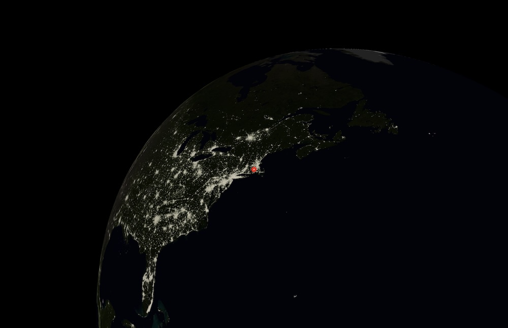

# Globe
Globe with three.js

## Instructions
* Start a server (for example, `python -m http.server 3000`) in the repository directory.
* Go to the server URL (for example, `localhost:3000`).
* Use the mouse to navigate.
* Press A to see a close-up of your current location.
* Press C to return to normal view centered on the globe.
* Press N to set the simulated time to match the real time.
* Press B to show/hide borders. (Borders are approximate.)
* Press space to play or pause day/night motion.

## Image Sources
* [Climate source](https://en.m.wikipedia.org/wiki/File:Köppen-Geiger_Climate_Classification_Map_(1980–2016)_no_borders.png#/media/File%3AKöppen-Geiger_Climate_Classification_Map.png)
* [Elevation source](https://upload.wikimedia.org/wikipedia/commons/thumb/2/2b/World_elevation_map.png/2560px-World_elevation_map.png)
* [Blue Marble source](https://commons.wikimedia.org/wiki/File:Blue_Marble_2002.png)
* [Night source](https://commons.wikimedia.org/wiki/File:The_earth_at_night.jpg)
* [Borders source](https://commons.wikimedia.org/wiki/File:Blank_World_Map_2022.png)

These raw images are placed in the `images` folder and processed by `update_koppen.py` to create the final images used by `main.js` for rendering.